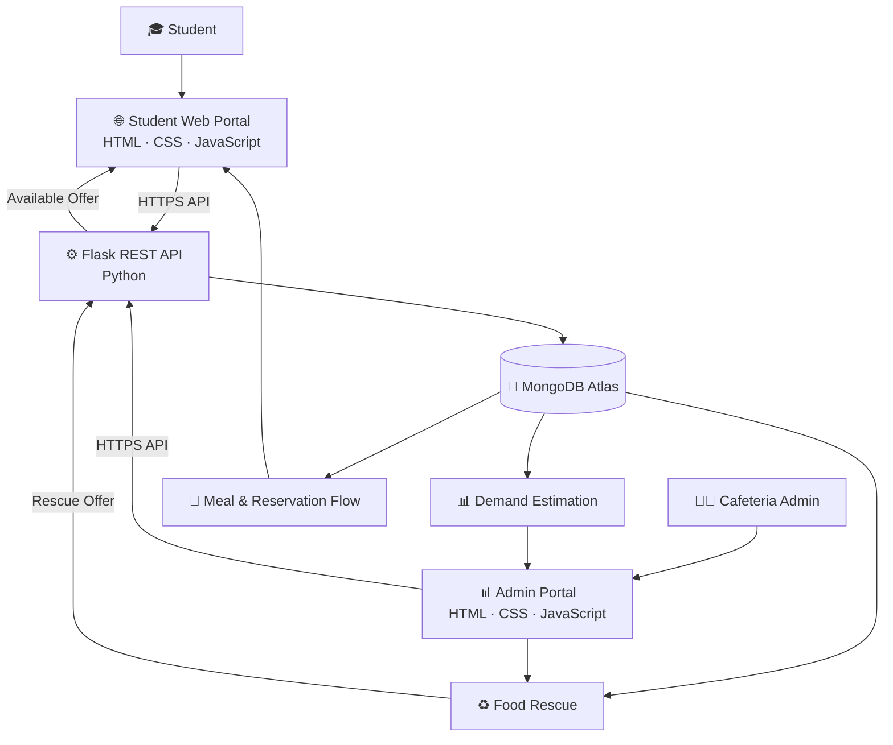

# 🍽️ FOOD LOOP
### Forkathon 2026 — KUET_KUMROPOTASH

> **Predict before preparing. Rescue before wasting. 🌱**

A smart campus food management platform that connects **students and cafeteria providers** to make meal preparation more demand-aware and reduce unnecessary food waste.

Built for **ForkedArch Freshers Hackathon 2026**.

---

## 👥 Team KUET_KUMROPOTASH

| Name | Roll | Department | GitHub |
|---|---:|---|---|
| **Durja Das** | 52507021 | CSE | [durjadas12-eng](https://github.com/durjadas12-eng) |
| **Farha Afsin Mahi** | 52507048 | CSE | [mahioops](https://github.com/mahioops) |
| **M. Sunzid Haque** | 52507012 | CSE | [sunzid874-code](https://github.com/sunzid874-code) |
| **Md. Siam Ahmmed** | 52507073 | CSE | [ahmmedsiam287-bot](https://github.com/ahmmedsiam287-bot) |

---

# 🎥 Presentation

### Hackathon Presentation Video

[▶️ Watch our presentation](https://drive.google.com/file/d/1B3i5oCzW4xMLFjrE2gfQOlKRszHctKTo/view?usp=sharing)

---

# 🌐 Live Demo

### Food Loop — Live Website

**https://forkedarch.github.io/Forkathon2026-Team-KUET_kumropotash/**

The project contains both:

- 🎓 **Student Portal**
- 👨‍💼 **Cafeteria Admin Portal**

---

# ❔ The Problem

## The Last Plate

At the end of the day, cafeterias can have untouched food while students may still be unsure about what will be available later.

The fundamental problem is uncertainty.

Cafeterias often prepare food based on estimated demand:

> **How many students will actually eat tomorrow?**

When the estimate is wrong:

```text
Too much preparation
        ↓
Surplus food
        ↓
Food waste
```

But the opposite can also happen:

```text
Too little preparation
        ↓
Insufficient meals
        ↓
Poor student experience
```

Meanwhile, students may have no simple way to communicate their meal requirements in advance or discover surplus food before it becomes waste.

### The challenge

How can technology connect the entire journey:

**Prediction → Preparation → Consumption → Surplus → Rescue**

instead of focusing only on food waste after it has already happened?

---

# 💡 Our Idea — FOOD LOOP

**Food Loop** creates a communication loop between **students and cafeteria providers**.

Instead of cafeterias simply guessing demand, students can communicate their meal intention in advance.

The cafeteria can then use the collected responses to estimate demand and make better preparation decisions.

And if surplus food still remains, it does not have to become waste.

The cafeteria can publish a **Food Rescue offer**, allowing students to discover and rescue the remaining food within a limited time.

### In one sentence:

> **Students communicate demand → Cafeterias prepare smarter → Surplus becomes an opportunity instead of waste.**

---

# 🔄 Why Is It Called FOOD LOOP?

Traditional cafeteria flow:

```text
Guess Demand
     ↓
Prepare Food
     ↓
Students Eat
     ↓
Leftover Food
     ↓
Waste
```

Food Loop changes that journey:

```text
       👨‍🎓 STUDENT
           │
           │ Meal Intention
           ▼
   📊 DEMAND ESTIMATION
           │
           ▼
   👨‍🍳 CAFETERIA
           │
           │ Smarter Preparation
           ▼
       🍛 MEAL
           │
           ▼
     🍽️ CONSUMPTION
           │
           ▼
   ♻️ SURPLUS FOOD
           │
           │ Rescue Offer
           ▼
       👨‍🎓 STUDENT
           │
           └───────────↺
```

This creates a continuous loop between **demand, preparation, consumption and rescue**.

---

# 🎯 What We Are Solving

Food Loop addresses several practical cafeteria problems:

- ❌ Uncertainty about expected student demand
- ❌ Over-preparation of meals
- ❌ Unnecessary food waste
- ❌ Lack of advance meal intention information
- ❌ Difficulty communicating student demand to cafeteria providers
- ❌ Surplus food remaining unused
- ❌ Students not knowing about available surplus meals
- ❌ Lack of a simple digital connection between students and cafeteria management

---

# 🧠 How Food Loop Works

## Step 1 — Student communicates meal intention

Students can indicate whether they plan to eat at the cafeteria the following day.

```text
Will Eat       → YES
Won't Eat      → NO
No Response    → PENDING
```

These responses provide the cafeteria with a clearer picture of expected demand.

---

## Step 2 — Admin sees demand information

The Admin Portal aggregates student responses and presents:

- Expected students
- Students who will eat
- Students who will not eat
- Pending responses

This transforms individual student choices into actionable cafeteria information.

---

## Step 3 — Cafeteria estimates preparation quantity

The system uses the expected demand to estimate how many meals should be prepared.

The current prototype also applies a small preparation buffer to reduce the risk of preparing too little food.

```text
Expected Demand
       +
Preparation Buffer
       ↓
Recommended Preparation
```

---

## Step 4 — Students reserve available meals

Students can browse available meals and reserve meals through the Student Portal.

A reservation can provide relevant information such as:

- Meal
- Price
- Availability
- Pickup information
- Category/tag

---

## Step 5 — Surplus becomes Food Rescue

Even with better demand estimation, surplus food may sometimes remain.

Instead of allowing that food to become waste, cafeteria providers can publish a **Food Rescue offer**.

A rescue offer can contain:

- Food name
- Discount
- Available quantity
- Rescue time window
- Location

Students can then discover the available offer and rescue the food before the time window expires.

---

# 👨‍🎓 Student Portal

The Student Portal is designed around the student's complete food journey.

### Students can:

- 🔐 Login using student credentials
- 🥗 Select personal interests
- 🍽️ Submit tomorrow's meal intention
- 📋 Browse available meals
- 🎟️ Reserve meals
- ♻️ Discover Food Rescue offers
- 📱 Access their personal dashboard
- 🔔 View relevant notifications
- 📊 View available personal food-impact information

### Student Journey

```text
Login
  ↓
Student Dashboard
  ↓
Meal Intention
  ↓
Browse Meals
  ↓
Reserve
  ↓
Food Rescue
  ↓
Personal Impact
```

---

# 👨‍💼 Cafeteria Admin Portal

The Admin Portal provides cafeteria management with a centralized view of student demand.

### Administrators can:

- 🔐 Access the Admin Portal
- 📊 View expected student demand
- ✅ Monitor students who will eat
- ❌ Monitor students who will not eat
- ⏳ Track pending responses
- 📈 Estimate required meal preparation
- ♻️ Manage surplus food rescue
- 🎓 Navigate to the Student Portal

### Admin Decision Flow

```text
Student Responses
       ↓
Demand Information
       ↓
Preparation Decision
       ↓
Meal Service
       ↓
Surplus?
   ↙       ↘
 NO        YES
 ↓          ↓
Done     Food Rescue
            ↓
         Students
```

---

# ♻️ Food Rescue

Food Rescue is one of the most important parts of Food Loop.

The idea is simple:

> **If food could not be prevented from becoming surplus, prevent the surplus from becoming waste.**

Instead of throwing away remaining food, cafeteria providers can create a limited-time rescue offer.

### Example

```text
🍛 Chicken Rice

Available: 20 portions
Discount: 30%
Rescue Window: 4:00 PM – 6:00 PM
Location: Campus Cafeteria
```

Students can discover the offer through the platform and help redirect surplus food toward consumption.

---

# 📊 Demand Estimation

Food Loop does not require the cafeteria to rely entirely on guesswork.

The Admin Portal provides a live view of student meal intentions.

For example:

```text
Will Eat       → 250
Won't Eat      → 80
Pending        → 40
```

From this information, the cafeteria can estimate the number of meals likely to be required.

### Current prototype approach

The current prototype uses student meal-intention responses as the primary signal for demand estimation.

A small preparation buffer is then applied:

```text
Recommended Preparation
= Expected Demand × 1.05
```

This is intentionally simple and transparent for the prototype.

### Future improvement

With more historical data, the same system can be extended into a stronger predictive model using factors such as:

- Historical consumption
- Day of week
- Academic calendar
- Special events
- Previous meal demand
- Weather
- Seasonal patterns

---

# 🌱 Impact

Food Loop aims to create impact at two levels.

## For Students

- Better visibility of available meals
- Easier meal planning
- Simple meal reservation
- Access to discounted surplus food
- Participation in reducing campus food waste

## For Cafeteria Providers

- Better understanding of expected demand
- More informed preparation decisions
- Visibility into student meal intentions
- A structured way to handle surplus
- Reduced dependence on guesswork

## For the Campus

```text
Better Demand Information
          ↓
Smarter Preparation
          ↓
Less Unnecessary Surplus
          ↓
Food Rescue
          ↓
Less Food Waste
```

---

# ✨ Key Features

| Feature | Purpose |
|---|---|
| 🔐 Student Login | Secure entry to the student portal |
| 🥗 Meal Intention | Students communicate tomorrow's meal requirement |
| 📊 Demand Estimation | Converts student responses into cafeteria insights |
| 🎟️ Meal Reservation | Allows students to reserve available meals |
| ♻️ Food Rescue | Redirects surplus food to students |
| 👨‍💼 Admin Dashboard | Gives cafeteria providers a centralized view |
| 📱 Responsive UI | Designed for different screen sizes |
| 🔔 Dashboard Information | Keeps students informed about their food activity |

---

# 🏗️ System Architecture



---

# 🔄 Core Data Flow

### Student → Backend → Database → Admin

```text
Student
   ↓
Meal Intention
   ↓
Frontend
   ↓
Flask REST API
   ↓
MongoDB Atlas
   ↓
Admin Dashboard
```

### Admin → Backend → Student

```text
Admin
   ↓
Food Rescue Offer
   ↓
Flask REST API
   ↓
MongoDB Atlas
   ↓
Student Portal
   ↓
Rescue Opportunity
```

---

# 🧩 System Components

## 1. Student Frontend

Responsible for:

- Student authentication interface
- Meal intention
- Meal browsing
- Reservations
- Food Rescue visibility
- Dashboard experience

**Technologies:** HTML, CSS, JavaScript

---

## 2. Admin Frontend

Responsible for:

- Admin authentication interface
- Student intention overview
- Demand estimation
- Cafeteria management information
- Food Rescue navigation

**Technologies:** HTML, CSS, JavaScript

---

## 3. Flask Backend

The backend acts as the central communication layer between the web interfaces and the database.

Responsibilities include:

- API requests
- Student authentication
- Student data handling
- Meal-intention processing
- Admin statistics
- Database communication
- CORS handling

**Technologies:** Python, Flask, Flask-CORS, Gunicorn

---

## 4. MongoDB Atlas

MongoDB Atlas provides cloud database storage for application data.

It allows the backend to persist and retrieve relevant student and cafeteria information.

**Technology:** MongoDB Atlas + PyMongo

---

# 🔌 Backend API

The Flask backend exposes REST API endpoints for communication between the frontend and database.

### Health Check

```http
GET /api/health
```

Used to check backend availability and help wake the deployed service before users perform important actions.

### Student Login

```http
POST /api/student/login
```

Used for student authentication and account handling.

### Admin Statistics

```http
GET /api/admin/stats
```

Provides the Admin Portal with aggregated student meal-intention information such as:

- Expected students
- Will eat
- Won't eat
- Pending responses

> Additional endpoints can be documented here as the backend API expands.

---

# 🛠️ Technology Stack

## Frontend

- **HTML5** — Page structure
- **CSS3** — Styling and responsive design
- **JavaScript (ES6+)** — UI interactions and API communication
- **LocalStorage** — Client-side session and preference persistence

## Backend

- **Python**
- **Flask** — REST API and server-side application
- **Flask-CORS** — Cross-Origin Resource Sharing
- **Gunicorn** — Production WSGI server

## Database

- **MongoDB Atlas** — Cloud database
- **PyMongo** — MongoDB integration with Flask

## Configuration

- **python-dotenv**
- Environment variables for sensitive configuration

## Deployment

- **GitHub Pages** — Frontend hosting
- **Render** — Backend deployment
- **MongoDB Atlas** — Cloud database

---

# 📁 Project Structure

```text
Forkathon2026-Team-KUET_kumropotash/
│
├── backend/
│   ├── app.py
│   ├── requirements.txt
│   └── ...
│
├── index.html
├── student.html
├── student.js
├── student.css
│
├── admin.html
│
├── rescue.html
│
├── script.js
├── style.css
│
├── .gitignore
├── LICENSE
├── CONTRIBUTING.md
└── README.md
```

> File names may evolve as the project is developed further.

---

# 🚀 Deployment

Food Loop uses a separated frontend/backend deployment architecture.

### Frontend

Hosted using:

**GitHub Pages**

### Backend

Hosted using:

**Render**

### Database

Hosted using:

**MongoDB Atlas**

```text
GitHub Pages
     │
     │ HTTPS
     ▼
Render / Flask API
     │
     ▼
MongoDB Atlas
```

---

# 🔐 Configuration & Security

Sensitive configuration such as database credentials should not be committed directly to the repository.

The backend uses environment variables through `python-dotenv`.

Example:

```env
MONGODB_URI=your_mongodb_connection_string
```

The `.gitignore` configuration is used to prevent sensitive local configuration files from being committed.

> **Note:** The current hackathon admin login is a prototype authentication flow. A production deployment should use server-side authentication, secure password handling, sessions/JWT, and proper authorization.

---

# 📱 Responsive Design

Food Loop is designed to work across different screen sizes.

The interfaces adapt for:

- 💻 Desktop
- 💻 Laptop
- 📱 Mobile
- 📟 Tablet-sized screens

The goal is to keep the core student and cafeteria workflows simple and accessible.

---

# 🧪 Current Prototype Scope

The current hackathon prototype demonstrates the core Food Loop workflow:

### Implemented

- Student portal
- Student login flow
- Student meal intention
- Admin portal
- Admin statistics
- Demand estimation
- Meal reservation interface
- Food Rescue workflow
- Responsive UI
- Flask REST API
- MongoDB integration
- GitHub Pages + Render deployment
- Backend health check

Some interface elements are intentionally presented as prototype/demo components rather than production-grade services.

---

# 🔮 Future Scope

Food Loop can be expanded significantly with more real-world data.

### 🤖 Advanced Demand Prediction

Use historical meal data and machine learning to predict:

- Daily demand
- Meal-specific demand
- Seasonal demand
- Event-based demand

### 📅 Academic Calendar Integration

Demand can be adjusted according to:

- Holidays
- Exams
- Vacations
- University events
- Department schedules

### 🌦️ Context-Aware Prediction

Future versions could consider:

- Weather
- Temperature
- Rain
- Special campus activities

### 📦 Real-Time Inventory

Cafeteria providers could track:

- Prepared quantity
- Consumed quantity
- Remaining quantity
- Ingredient inventory

### ♻️ Automated Rescue Alerts

Students could receive notifications when:

> **Fresh surplus food becomes available near them.**

### 📈 Long-Term Analytics

The admin dashboard could provide:

- Waste trends
- Demand accuracy
- Rescue rate
- Meal popularity
- Consumption patterns
- Monthly sustainability reports

---

# 🏆 Why Food Loop?

Food Loop is not simply a food-ordering system.

It is not only a cafeteria dashboard.

And it is not only a food-rescue platform.

It connects the entire journey:

```text
      PREDICT
         ↓
     PREPARE
         ↓
     CONSUME
         ↓
      SURPLUS
         ↓
       RESCUE
         ↓
      CONSUME
         ↺
```

The key idea is **joint participation**.

### Students provide the signal.

### Cafeteria providers make the decision.

### The platform connects both sides.

And when prediction is not enough:

### Food Rescue closes the loop.

---

# 🌍 Our Vision

We envision a campus where food preparation is driven by information rather than guesswork.

Where students are not just consumers, but active participants in the food-management system.

Where cafeteria providers have better visibility into demand.

And where surplus food gets a second chance before becoming waste.

> ### **Food Loop**
> **Predict before preparing.**
>
> **Rescue before wasting.**
>
> **Build a smarter, more sustainable campus. 🌱**

---

# 🤖 AI Assistance & Disclosure

AI tools were used as supportive development and productivity tools during the hackathon.

### Tools Used
- **ChatGPT** — brainstorming, problem refinement, documentation, debugging assistance, code explanation, and UI/content improvement.
- **AI-assisted development** — used selectively to help review and improve frontend/backend code and troubleshoot implementation issues.

### How AI Was Used

AI assistance was primarily used for:
- 💡 Brainstorming and refining the Food Loop concept
- 🧩 Discussing system architecture and implementation approaches
- 🐛 Debugging and troubleshooting code
- 🎨 Improving UI/UX ideas and interface content
- 📝 Structuring and polishing project documentation and README
- 🔍 Reviewing code and identifying potential issues

The **project concept, feature selection, system decisions, implementation, integration, testing, and final submission were handled and reviewed by the team**.

AI-generated suggestions were reviewed, adapted, tested, and integrated by the team where appropriate. The team remains responsible for the final code, functionality, accuracy, and originality of the project.

> **AI was used as an assisting tool, not as a replacement for the team's technical decisions and implementation work.**

---

# 📌 Quick Links

🌐 **Live Website**  
https://forkedarch.github.io/Forkathon2026-Team-KUET_kumropotash/

🎥 **Presentation Video**  
https://drive.google.com/file/d/1B3i5oCzW4xMLFjrE2gfQOlKRszHctKTo/view?usp=sharing

💻 **GitHub Repository**  
https://github.com/ForkedArch/Forkathon2026-Team-KUET_kumropotash

---

# ❤️ Built with teamwork by KUET_KUMROPOTASH

**Forkathon 2026**

> *From predicting meals to rescuing leftovers — closing the Food Loop.*
