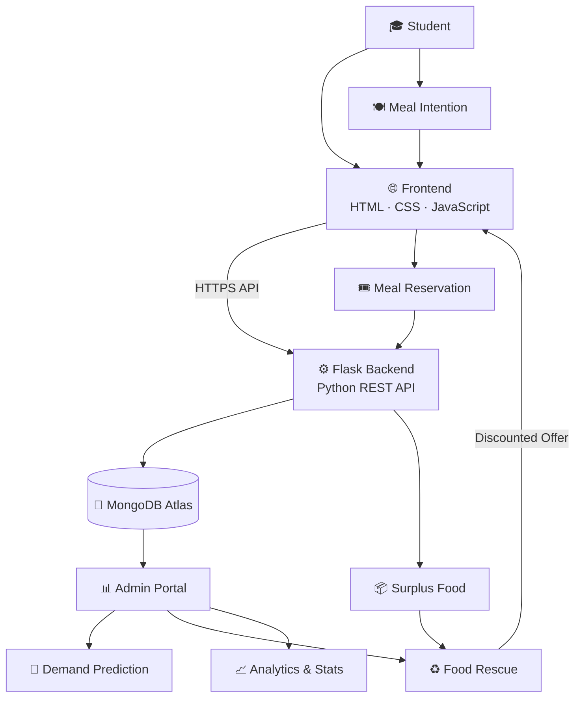

# Forkathon 2026: FOOD LOOP by [KUET_KUMROPOTASH]

> Built for ForkedArch Freshers Hackathon 2026

## 👥 Team Members

| Name              | Roll     | Department | GitHub           |
| ------------------| -------- | ---------- | --------------   |
| Durja Das         | 52507021 | CSE        | durjadas12-eng   |
| Farha Afsin Mahi  | 52507048 | CSE        | mahioops         |
| M. Sunzid Haque   | 52507012 | CSE        | sunzid874-code   |
| Md. Siam Ahmmed   | 52507073 | CSE        | ahmmedsiam287-bot|               |

---

## ❔ Problem

### Problem Statement

> Here is the Problem Statement for  KUET_Kumropotash,

The Last Plate

At the end of the day, a cafeteria has trays of untouched food. Meanwhile, somewhere nearby, students are wondering whether they should order something because they don't know what will be available later.

Every day, food is prepared based on guesses. Some days there isn't enough. Other days, far too much remains.

Maybe we create a technology-driven approach to reduce unnecessary food waste while improving the experience for both food providers and consumers?

Your system could help predict demand, track consumption, redistribute surplus, communicate availability, or encourage better decisions.

And also maybe a solution if somehow leftover foods are there, the leftover foods should not have been wasted.


Brainstorming twist: Don't focus only on reducing food. Think about the entire journey from prediction → preparation → consumption → leftovers.

# 🍽️ KUET CampusMate — Food Loop

> A smart campus food management platform designed to reduce food waste, improve meal planning, and create a better dining experience for students and cafeteria management.

🌐 **Live Website:**  
https://forkedarch.github.io/Forkathon2026-Team-KUET_kumropotash/

---

## 🚀 About the Project

**KUET CampusMate — Food Loop** is a smart campus dining solution developed for the **KUET Hackathon**.

The platform connects students with campus cafeteria services through a simple digital interface. Students can provide their meal preferences, reserve meals, discover surplus food offers, and track their impact.

At the same time, cafeteria administrators can use student responses to estimate meal demand and make better preparation decisions.

The main goal is simple:

> **Prepare what students need, reduce what gets wasted.**

---

## 🎯 Problem We Are Solving

Campus cafeterias often face a major challenge:

- ❌ Uncertainty about how many students will eat
- ❌ Over-preparation of food
- ❌ Food wastage
- ❌ Difficulty tracking student meal preferences
- ❌ Lack of a simple digital reservation system
- ❌ Surplus food going unused

Food Loop addresses these problems by collecting student meal information and providing useful demand insights to cafeteria management.

---

## 💡 Our Solution

Food Loop provides a centralized platform where:

### 👨‍🎓 Students can

- Login using their student roll and password
- Select personal interests
- Submit tomorrow's meal requirement
- Browse available meals
- Reserve meals
- Receive reservation/pickup tokens
- Discover surplus food rescue offers
- View their personal food impact
- Access their student dashboard

### 👨‍💼 Administrators can

- Access the Admin Portal
- View expected student demand
- Monitor Yes / No meal responses
- Track pending responses
- Estimate required meal preparation
- View food rescue/surplus information

---

# ✨ Key Features

## 🔐 Student Login

Students can securely enter their roll number and password to access the platform.

New students can also be registered automatically through the backend.

---

## 🍛 Tomorrow's Meal Prediction

Students can tell the cafeteria whether they require a meal for the following day.

The response is stored in the database and contributes to overall demand estimation.

This helps the cafeteria prepare a more appropriate amount of food.

---

## 🥗 Personalized Interests

Students can select multiple interests during onboarding.

These preferences can be used to improve future personalization and recommendation features.

---

## 🎟️ Meal Reservation

Students can browse available meals including:

- Chicken Biryani
- Vegetable Khichuri
- Grilled Chicken Bowl

Each meal contains information such as:

- Price
- Availability
- Pickup time
- Category/tag
- Meal description

Students can reserve a meal directly from the dashboard.

---

## ♻️ Food Rescue

The platform supports a **Food Rescue** concept for surplus meals.

Cafeteria administrators can publish surplus food offers containing:

- Food name
- Discount percentage
- Available quantity
- Rescue time window
- Location

Students can then discover available surplus meals and help reduce food waste.

---

## 📊 Admin Demand Dashboard

The Admin Portal provides cafeteria management with useful demand information such as:

- Expected students
- Confirmed meal requirements
- Students not requiring meals
- Pending responses
- Predicted meal demand
- Recommended preparation quantity

This transforms student responses into actionable cafeteria data.

---

## 📱 Responsive Student Dashboard

The student portal is designed to provide a clean and responsive experience across desktop and mobile devices.

The dashboard includes:

- Today's menu
- Meal reservations
- Rescue meals
- Personal impact
- Notifications
- Student information
- Quick actions

---

# 🛠️ Technology Stack

## Frontend

- **HTML5** — Structure and page layout
- **CSS3** — Styling, responsive design and UI
- **JavaScript (ES6+)** — Interactions, API communication and dynamic content
- **LocalStorage** — Client-side session and preference persistence

## Backend

- **Python**
- **Flask** — REST API and server-side application
- **Flask-CORS** — Cross-Origin Resource Sharing
- **Gunicorn** — Production WSGI server

## Database

- **MongoDB Atlas**
- **PyMongo** — MongoDB integration with Flask

## Environment & Configuration

- **python-dotenv**
- Environment variables for sensitive configuration such as database credentials

## Deployment

- **GitHub Pages** — Frontend hosting
- **Render** — Backend deployment
- **MongoDB Atlas** — Cloud database

---

# 🔌 Backend API

The Flask backend provides API endpoints for communication between the frontend and database.
markdown

### Student Login

```http
POST /api/student/login
```


## 🏗️ System Architecture



### 🔄 Core Data Flow

**Student → Frontend → Flask API → MongoDB → Admin Portal**

**Admin → Flask API → MongoDB → Food Rescue Offer → Student**

### 🧠 How Food Loop Works

Food Loop collects student meal intentions to estimate cafeteria demand before food is prepared. This helps cafeteria administrators prepare a more appropriate amount of food and reduce unnecessary waste.

When surplus food remains, administrators can create a **time-limited discounted Food Rescue offer**. The offer is then displayed prominently on the student portal so students can rescue the available food before it becomes waste.

### 🛠️ Technology Stack

`HTML` · `CSS` · `JavaScript` · `Python Flask` · `REST API` · `MongoDB Atlas`

> **Predict before preparing. Rescue before wasting. 🌱**


                 
